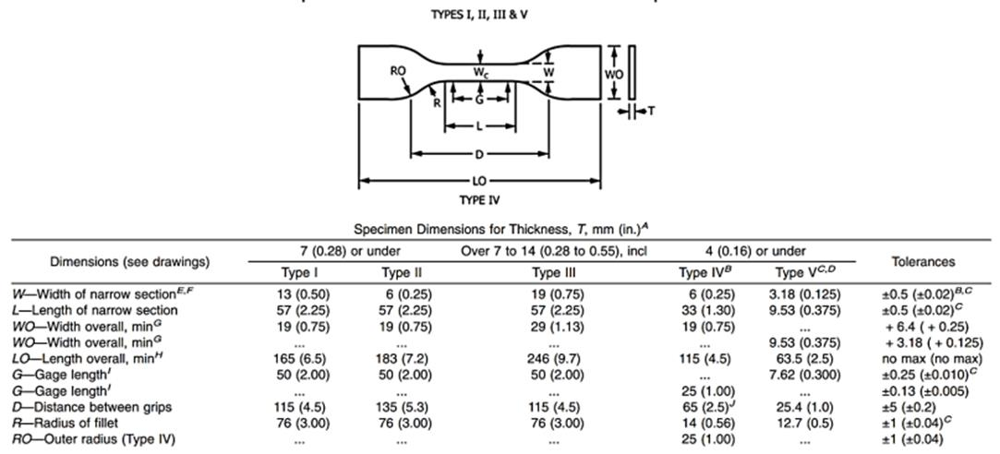

```{r setup, include=FALSE}
library(learnr)
library(shiny)
library(ggplot2)
#library(patchwork)
```

## Acknowedgement
<center>

</center>

<br> </br>
The following data was collected at the University of Utah in the Mechanical Engineering Strengths Laboratory under the direction of **Jeff Kessler**. **Melynda Schreiber** and **Ugochuckwu Nze** were the principal investigators of this research. This project was funded by **Dr.Andrew Merryweather** in the Ergonomics and Safety Lab at the University of Utah. The data from this project is now being used to teach Design of Experiments concepts to university students.

This tutorial is a beginning module to accompany the Design of Experiments course at the University of Utah. Some major goals of this tutorial include:
<ul>
<li> Using R commands to describe your data</li>
<li> Visualizing outliers and distributions</li>
<li> Know Your Assumptions</li>
<li> Understanding Normal Distributions</li>
<li> Running your first t.test</li>
<li> Performing analysis on multiple comparisions</li>
</ul>

This tutorial will use a Mechanical Engineering based dataset to cover basic priniciples discussed in Design of Experiments.

## Dataset Description {data-progressive=TRUE}

### Purpose

Fused deposition modeling (FDM) or 3D printing is of ever increasing interest to the engineering community. Its capability for quick turnaround times between modeling and fabrication has made 3D printing very useful for manufacturing. Advances in 3D printing such as the employment of new printing materials and varied nozzle size for increased resolution have made it possible for a wide range of parts to be produced quickly and at a low cost. While new methods have been produced to expand the range of materials that can be printed, not much study has been conducted on the strength characteristics of these materials. For example, materials such as ABS, PLA and HIPS can be used as structural and support materials. Each material has various strength characteristics that have been quantified for the bulk material but not within the context of a 3D printed part [1].

Strength characteristics of materials are dependent on many construction parameter of the 3D printed part. Unfortunately, the effect of certain part construction parameters on 3D printed parts has not been investigated for the many common materials on the market [1]. Basic tensile tests that have been performed in 3D printed parts are focus on axial contributions and raster angle contributions to tensile strength [2]. Axial test are performed on 3D printed parts by axially printing sheets of one particular material. The parts are then milled into the shape of standard D638 Type IV tensile test specimens as seen in Figure 5. Unfortunately, these tests have broken out of the gauge region causing some tensile test measures to be invalid [3]. Another approach to quantifying strength 3D printed parts was adjusting the raster angles or the angles of print between axial and 45 degrees. It was determined that a raster angle of 45 degrees resulted in a print that had greater tensile strength. Fill density, another structural property of 3D printed parts has been investigated as well[1].

There are four major goals in the investigation of this dataset: 1) determine basic strength characteristics of D638 Type IV tensile specimens for ABS, PLA and HIPS 3D printed materials 2) produce stress-strain curves for different materials and varying constructions of 3D printed D638 Type IV tensile specimens, and 3) use multiple regression to determine the contribution of layer thickness, perimeter thickness and fill density to strength characteristics of a 3D printed D638 Type IV Specimens and 4) determine if significant differences in strength exist for wall in `tensile stress` and `strain` as they relate to `wall thickness`, `number of layers` and `fill density`. 

### Methodology

<p> Strength characteristics of 3D printed parts were tested and observed using the ISO Standard for Tensile Properties of Plastics for D638-02a Type IV specimens. All specimens were printed in ideal conditions by the same user with a Lulzbot Taz Version 5 3D printer. The Lulzbot Taz is considered a reliable commercial printer that has been used in many published studies for quantification of tensile properties in 3D printed parts [R]. It has also been compared to other printers and has been noted as more reliable. The Lulzbot’s recommended software, Cura was used to create the G-code for all printed parts. The print location did not change for any of the sets of specimens. All parts were allowed to cool briefly before removal to prevent warping. Extra material created by the brim was removed via filing before testing. Gauge marks were placed on the specimen with a pen that did not scratch, puncture or impress the specimen. Slight variation was observed between some dimensions of printed parts. Every specimen was labeled with a specific identifier. </p>


|Printing Measures|ABS|PLA|HIPS|
|:-:|:-:|:-:|:-:|
|Layer Height|0.15 mm|0.15 mm|0.15 mm|
|Print Speed|40 mm/s|40 mm/s|40 mm/s|
|Nozzle Temperature|240 C|200 C|240 C|
|Bed Temperature|110 C|60 C|110 C|
|Brim|10 mm|10 mm|10 mm|
|Bottom Layer Speed|15 mm/s|15 mm/s|15mm/s|
|Infill Speed|50 mm/s|50 mm/s|50 mm/s|
|Fill Pattern|Rectangular|Rectangular|Rectangular|
|Filament Color|Blue|White|Yellow|
|Filatment Diameter|3.0 mm|3.0 mm|3.0 mm|
|Manufacturer|Imagine That|eSun|eSun|

Table: Printing Characteristics

### ISO Standards
Each specimen was printed using an accurate model of the D638 Type IV tensile specimen according to the ISO standard for plastics. See illustration and respective table below for more information. Each specimen was tested in the Instron according to the ISO Standard at 5 mm/min for Type IV specimens. Unfortunately, due to time only three specimens were tested instead of the required ten specimens as specified by ISO standards. All values were measured and reported in SI units. All specimens were tested in room temperature and acceptable humidity.



### Observed Factors
A total of 72 specimens were test in the Instron tensile testing machine. A total of three specimens were printed and tested for each set of treatments. There were eight treatments being tested per material. To test for these changes the data was collected using three 3D printer filament materials, Acrylonitrile butadiene styrene (ABS), Polylactide (PLA) and High Impact Polystyrene (HIPS). Overall, there were 24 test treatments with three replicates per treatment. Table II shows all the treatments that were used in this analysis. To account for errors with bed warping, all specimens were labeled according to their orientation on the plate as, left, middle and right. Each specimen was printed in the center of the plate with a brim of 10 mm.

```{r Find Area, include = FALSE}
find_area <- function(wall_thickness, number_of_layers, fill_density){
  narrow_section <- 6.35
  height <- 4.064
  top_and_bottom <- 2*number_of_layers*0.15*narrow_section
  perimeter_area <- wall_thickness*2*(height-(number_of_layers*2*0.15))
  total_area <- 6.25*height
  fill_area <- (fill_density/100)*(total_area-top_and_bottom-perimeter_area)
  resulting_area <- top_and_bottom+perimeter_area+fill_area
  return(resulting_area)
}

find_percentage <- function(wall_thickness, number_of_layers, fill_density){
  height <- 4.064
  total_area <- 6.25*height
  resulting_area <- find_area(wall_thickness, number_of_layers, fill_density)
  return((resulting_area/total_area)*100)
}
```

The following conditions were teseted as shown in the table below. All parts have a minimum of 0.6 mm and a maximum of 1.2 mm thick of solid layers. 


|Wall Thickness|Top/Bottom Layers |Fill Density|Cross-Sectional Area|
|:-:|:-:|:-:|:-:|-:|
|1 mm|2 layers x 0.15 mm 45 degree raster angle|30 %|`r round(find_area(1,2,30), 1)` mm (`r round(find_percentage(1,2,30),2)` \%)|
|1 mm|2 layers x 0.15 mm 45 degree raster angle|60 %|`r round(find_area(1,2,60), 1)` mm (`r round(find_percentage(1,2,60),2)` \%)|
|1 mm|4 layers x 0.15 mm 45 degree raster angle|30 %|`r round(find_area(1,4,30), 1)` mm (`r round(find_percentage(1,4,30),2)` \%)|
|1 mm|4 layers x 0.15 mm 45 degree raster angle|60 %|`r round(find_area(1,4,60), 1)` mm (`r round(find_percentage(1,4,60),2)` \%)|
|2 mm|2 layers x 0.15 mm 45 degree raster angle|30 %|`r round(find_area(2,2,30),1)` mm (`r round(find_percentage(2,2,30),2)` \%)|
|2 mm|2 layers x 0.15 mm 45 degree raster angle|60 %|`r round(find_area(2,2,60),1)` mm (`r round(find_percentage(2,2,60),2)` \%)|
|2 mm|4 layers x 0.15 mm 45 degree raster angle|30 %|`r round(find_area(2,4,30),1)` mm (`r round(find_percentage(2,4,30),2)` \%)|
|2 mm|4 layers x 0.15 mm 45 degree raster angle|60 %|`r round(find_area(2,4,60),1)` mm (`r round(find_percentage(2,4,60),2)` \%)|

Table: Specimen Treatments

<center>

</center>


### Test Procedure

The corresponding Instron program BlueHill 3 was used to preprogram testing setting and outcome measures. Each sample was identified according to its identification number as well as its tested factor characteristics. The specimen was inserted into clamps and tightened. The load was mechanically zeroed before the initiation of tests. The strain gauge was calibrated before each testing session. Before each test the strain gauge was placed on the specimen and balanced. Most tests were performed till failure of the material, with the extensomer still connected to the spe
cimen.

### Outcome Measures

In accordance with the ISO standard many variables were measured including, `tensile strength at yield` (three significant figures), `tensile strength at break` (fracture strength – three significant figures), `percentage of elongation at yield`, `percentage of elongation at break`, `normal strain`, `normal strain at break` and `modulus of elasticity`. All tensile stress measures were calculated using a percentage of solid cross-sectional area.

The standard equation for tensile stress is as follows: $$\sigma = \frac{F}{A}$$
Therefore, the solid layer cross-sectional area, perimeter cross sectional area and the remainder fill percentage was added and used in place of area.$$\sigma = \frac{F}{A_{Layers}+A_{Perimeter}+FD*(1-A_{Layers}-A_{Perimeter})}$$ 

Although it is a desired measure, Poisson’s ratio could not be determined due to the use of only a uniaxial extensometer.
To begin, we will load the data from the Excel worksheet. For the basic information we will select the first sheet. We can show the first or last five rows of the dataframe using `head(dataframe)` and `tail(dataframe)` respectively. Adding `()` can show the entire data frame at once in a paged form. I can label each block of code for reference in the future.

```{r Load Specimen Information, message = FALSE}
library("readxl")
(specimen_information <- read_excel("www/3DPrintingSpecimen.xlsx", 1, range = "B1:G73"))
```

Print the last five rows of data in the dataframe, `specimen_information`.

```{r show_tail, exercise=TRUE}

```

```{r show_tail-solution}
tail(specimen_information)
```

Next, we need to extract all the data from each sheet in the excel document. I can use `read_excel` to the load the sheet and spcify `filename`, the sheetname in `sheet` and the number of lines to `skip`. While other formats can be used, this data is stored as an excel sheet. I can use `paste0` to create a string without spaces. By placing this in a loop, we can create filenames for the workspace. Temporary data in a loop can then be `assign(variable_name, data)` to an automatically created `variable_name`. There are a lot of steps here, so most of the work has been done for you.

```{r Load all data as Dataframes, echo= FALSE, message=FALSE, warning = FALSE}
i <- 1
for (i in 1:range(72)){
  temp_data <- read_excel("www/3DPrintingSpecimen.xlsx", sheet = paste0("Specimen_RawData_", i), skip = 17)
  colnames(temp_data) <- c("Time_sec", "Tensile_Stress_MPa", "Strain_m", "Load_N", "Extension_mm")
  assign(paste0(specimen_information$Material[i], "_", specimen_information$`Print Position`[i], "_WT", specimen_information$`Wall Thickness`[i], "_NL", specimen_information$`Number of Layers`[i], "_FD", specimen_information$`Fill Density`[i]), temp_data)
  i <- i+1
}
```

## Stress-Strain Curves {data-progressive=TRUE}

### Plotting the Stress-Strain Curve

Now that we have extracted some data from the excel sheet, let's look at the data that was recorded.

```{r}
head(ABS_Left_WT1_NL2_FD30)
```

Since this is a stress-strain curve, it would be good to plot the curve. Let's load the `ggplot2` library and plot our first stress-strain curve. We can call the `ggplot()` function and `+` a line using the function `geom_line(data = dataframe, mapping = aes(x = x_variable, y = y_variable))`. 

```{r shiny_implementation definition, echo = FALSE}
library(ggplot2)
library(readr)
inputPanel(
  selectInput("material", label = "Material:",
              choices = c('ABS', 'HIPS', 'PLA'), selected = 'ABS'), # , width = '40%'

  selectInput("position", label = "Print Position:",
                choices = c('Left', 'Middle', 'Right'), selected = 'Left'),
  
  selectInput("wall", label = "Wall Thickness:",
                choices = c('WT1', 'WT2'), selected = 'WT1'),
  
  selectInput("layer", label = "Number of Layers:",
                choices = c('NL2','NL4'), selected = 'NL2'),
  
  selectInput("fill", label = "Fill Density:",
                choices = c('FD30','FD60'), selected = 'FD30')
)
plotOutput("curve")
```

```{r shiny_implementation server, context="server"}
output$curve <- renderPlot({
  dataframe <- paste(input$material, input$position, input$wall, input$layer, input$fill, sep = "_")
  stress_strain_data <- read_csv(paste0("www/", dataframe, ".csv"))
  ggplot(data = stress_strain_data) + geom_line(mapping = aes(Extension_mm, y = Load_N)) +   xlab("Strain (mm)") + ylab("Stress (N)") + ggtitle("Stress Versus Strain of Different Materials Under the Same Conditions") + xlim(0,3) + ylim(0,1200)
})
```

Plot the stress-strain curve from the dataframe, `ABS_Left_WT1_NL_FD30`. 

<center>
```{r plot_stress_strain, exercise = TRUE}
# Load the library ggplot2

# Create an object called one_treatment
one_treatment <- ggplot() +
geom_line(data = ABS_Left_WT1_NL2_FD30[1:(nrow(ABS_Left_WT1_NL2_FD30)-10),], mapping = aes(x = , y = ))
one_treatment
```
</center>

<center>
```{r plot_stress_strain-solution}
library(ggplot2)
one_treatment <- ggplot() +
geom_line(data = ABS_Left_WT1_NL2_FD30[1:(nrow(ABS_Left_WT1_NL2_FD30)-10),], mapping = aes(x = Extension_mm, y = Load_N))
one_treatment
```
</center>

### Adding Labels and Aestetics to Graphs

Once the basic graph is created, we can add labels and other aestetics. This graph is missing a title and better formatted axes. Add a title to the graph with a geom layer by using `+ ggtitle("My Graphs Title")`. Title the graph, *The Stress-Strain Curve of One ABS Sample*. Axes labels can be added as a geom layer using `+xlab("x-label")` and `+ylab("y-label")` Be sure to label the x-axis as "Strain (mm)" and the y-axis as "Stress (N)".

<center>
```{r add_labels, exercise = TRUE}
library(ggplot2)
one_treatment <- ggplot() +
geom_line(data = ABS_Left_WT1_NL2_FD30, mapping = aes(x = Extension_mm, y = Load_N)) 
one_treatment
```
</center>

<center>
```{r add_labels-solution}
library(ggplot2)
one_treatment <- ggplot() +
geom_line(data = ABS_Left_WT1_NL2_FD30, mapping = aes(x = Extension_mm, y = Load_N)) + ggtitle("The Stress-Strain Curve of One ABS Sample") + xlab("Strain (mm)") + ylab("Stress (N)")
one_treatment
```
</center>

### Plotting Multiple Lines on the Same Graph

To add additional lines, you can `+ geom_line(data = dataframe, mapping = aes(x = x_variable, y = y_variable))`. We can also change the linetype for each line by using the parameter `linetype` where common linetypes are `dashed`, `solid` and `dotted`. Plot the stress-strain curve of the left specimen with a wall thickess of 1mm, two number of solid layers and a fill density of 30% for each material (ABS, PLA and HIPS).

<center>
```{r multiple_stress_strain, exercise = TRUE}
# Plot stress and strain curves of ABS, HIPS and PLA
library(ggplot2)
multiple_treatment <- ggplot() +
geom_line(data = ABS_Left_WT1_NL2_FD30, mapping = aes(x = Extension_mm, y = Load_N, linetype = , colour=)) 
```
</center>

<center>
```{r multiple_stress_strain-solution}
# Plot stress and strain curves of ABS, HIPS and PLA
library(ggplot2)
multiple_treatment <- ggplot() +
geom_line(data = ABS_Left_WT1_NL2_FD30, mapping = aes(x = Extension_mm, y = Load_N, linetype = "solid", colour="blue")) +
geom_line(data = HIPS_Left_WT1_NL2_FD30, mapping = aes(x = Extension_mm, y = Load_N), linetype = "dashed", colour="red") + 
geom_line(data = PLA_Left_WT1_NL2_FD30, mapping = aes(x = Extension_mm, y = Load_N), linetype = "dotted", colour="green") +
  xlab("Strain (mm)") + ylab("Stress (N)") + ggtitle("Stress Versus Strain of Different Materials Under the Same Conditions")  
multiple_treatment
```
</center>

## Extracting Stress and Strain

Now, we need to extract the needed information from the raw data. Some information that we might be interested in include the `yield stress`, `ultimate stress`, `fracture stress`, `engineering strain`, `total strain`, `Young's modulus`. `modulus of resilience` and `modulus of toughness`. **Yield stress** is the stress occuring when the eleastic limit has passed and the material is permanately deformed. The yield stress can be find by identifying the stress shortly after the end of the elastic region. **Ultimate stress** is the value of peak stress on the stress-strain curve. Ultimate stress can simply by found by identifying the maximum stress for each specimen. **Fracture stress** is the stress at the point of breaking or fracturing. The value can be extract towards the end of the stress-strain curve. **Engineering Strain** is a measure extracted from the extensometer which is the change in specimen's guage length divded by the original specimen length. **Total strain** is the strain occuring at the time of fracture. Similar to fracture stress, the total strain is the strain value at the end of the stress-strain curve. **Young's modulus** or modulus of eleasticity is the constant of proportionality which shows the linear relationship between stress and strain of a material. To obtain this value, the slope of the stress strain curve when it is linear must be extracted. **Modulus of resilience** is the area under the stress-strain curve when the stress has reached the proportional limit. **Modulus of toughness** is the area under the entire stress-strain curve. 

Can get these variables, a function to extract the data must be created. Then the `get` function can extract some information from the raw data that in the workspace. 

```{r}
find_metrics <- function(data){
  FS <- data$Load_N[length(data$Load_N)-50]
  US <- max(data$Load_N)
  TS <- data$Extension_mm[length(data$Extension_mm)-50]
  YM <- data$Load_N[20:50]/data$Extension_mm[20:50]
  results <- c(FS, US, TS, YM)
  return(results)
}

i <- 1
specimen_metrics <- data.frame(matrix(nrow = 72, ncol = 9))
for (i in 1:range(72)){
  temp_data <- get(paste0(specimen_information$Material[i], "_", specimen_information$`Print Position`[i], "_WT", specimen_information$`Wall Thickness`[i], "_NL", specimen_information$`Number of Layers`[i], "_FD", specimen_information$`Fill Density`[i]))
  values <- find_metrics(temp_data)
  specimen_metrics[i, 1] <- specimen_information$Material[i]
  specimen_metrics[i, 2] <- specimen_information$`Print Position`[i]
  specimen_metrics[i, 3] <- specimen_information$`Wall Thickness`[i]
  specimen_metrics[i, 4] <- specimen_information$`Number of Layers`[i]
  specimen_metrics[i, 5] <- specimen_information$`Fill Density`[i]
  specimen_metrics[i, 6] <- values[1]
  specimen_metrics[i, 7] <- values[2]
  specimen_metrics[i, 8] <- values[3]
  specimen_metrics[i, 9] <- round(values[4],1)
  i <- i+1
}
colnames(specimen_metrics) <- c("Material", "PrintPosition", "WallThickness", "NumberofLayers", "FillDensity", "FractureStress", "UltimateStress", "TotalStrain", "YoungsModulus")
```

Again, the hard work has been done so that we can focus on the statistics. First, what does the dataframe look like. Use the `head()` function to show part of the dataframe. 
```{r show_dataframe, exercise = TRUE}

```

```{r show_dataframe-solution}
head(specimen_metrics)
```

## Summary Dataframe

There are a number of methods that can be used to describe the data you are using. It is best to visually inspect your data as well as running subject and non-sujbective test for normality. 
```{r}
head(specimen_metrics)
```

## Normality


```{r shiny_shapiro, echo = FALSE}
inputPanel(
  textInput("mean1", label = "Mean:", value = 10),
  textInput("sd1", label = "Standard Deviation:", value = 5),
  sliderInput("num_samples", label = "Number of Samples:", min = 0, max = 500, value = 500),
  textInput("alpha", label = "Alpha:", value = "0.05")
)

mainPanel(
    fluidRow(splitLayout(cellWidths = c("50%", "50%"), plotOutput("distributions"),plotOutput("normality"))),
    fluidRow(textOutput("pvalue"))
)

```

```{r shiny_shapiro server, context="server"}
output$distributions <- renderPlot({ 
  
  x_label <- "Mean Value"
  set.seed(42)
  dist1 <- rnorm(input$num_samples, mean=as.numeric(input$mean1), sd=as.numeric(input$sd1))
  set.seed(42)
  dist2 <- rnorm(input$num_samples, mean=0,sd=10)
  data_df <- data.frame(cbind(dist1, dist2))
  colnames(data_df) <- c("Dist1", "Dist2")
  
  data <- data.frame(dens = c(dist1, dist2), distributions = rep(c("Dist1", "Dist2"), each = input$num_samples))
  colnames(data) <- c("dens", "distributions")
  density_data <- ggplot(data, aes(x = dens, fill = distributions))
  boxplot_data <- ggplot(data, aes(x = distributions, y = dens, fill = distributions))
  
  density_data + geom_density(alpha = 0.5) + labs(x= x_label, y = "Density", fill = "Distributions") + theme(legend.position = "none")
  })

output$normality <- renderPlot({ 
  
  set.seed(42)
  dist1 <- rnorm(input$num_samples, mean=as.numeric(input$mean1), sd=as.numeric(input$sd1))
  qqnorm(dist1)
  qqline(dist1)
  })

output$pvalue <- renderText({
  
  set.seed(42)
  dist1 <- rnorm(input$num_samples, mean=as.numeric(input$mean1), sd=as.numeric(input$sd1))
  normality_results <- shapiro.test(dist1)
  normality <- normality_results$p.value
  
  paste("Shapiro Test P-Value", round(normality, 3))
  })

```

## Testing Skewness

<center>
```{r shiny_skewness, echo = FALSE}
inputPanel(
  selectInput("choose_skewness", label = "Skewness:",
                choices = c('Left Skew', 'Normal Distribution', 'Right Skew'), selected = 'Left Skew')
)

mainPanel(
  fluidRow(
    splitLayout(cellWidths = c("50%", "50%"), plotOutput("types_of_skew"),plotOutput("skew_qqline")))
)

```


```{r shiny_skewness server, context="server"}

output$types_of_skew <- renderPlot({ 
  
  x_label <- "Mean Value"
  y_label <- "Density"
  set.seed(42)
  
  left <- rbeta(1000,5,2)
  normal <- rnorm(1000)
  right <- rbeta(1000,2,5)
  data <- data.frame("Left" = left, "Normal" = normal, "Right" = right)
  
  if (input$choose_skewness == "Left Skew"){
    density_data <- ggplot(data, aes(x = Left))
    density_data + geom_density(alpha = 0.5) + labs(x= x_label, y = y_label) + theme(legend.position = "none")
    
  }
  
  else if (input$choose_skewness == "Normal Distribution"){
    density_data <- ggplot(data, aes(x = Normal))
    density_data + geom_density(alpha = 0.5) + labs(x= x_label, y = y_label) + theme(legend.position = "none")
    
  }
  
  else if (input$choose_skewness == "Right Skew"){
    density_data <- ggplot(data, aes(x = Right))
    density_data + geom_density(alpha = 0.5) + labs(x= x_label, y = y_label) + theme(legend.position = "none")
  }
  
  })

output$dist_skewness <- renderText({
  normality_results <- shapiro.test(data$Left)
  normality <- normality_results$p.value
  paste("Shapiro Test P-Value", round(normality, 3))
  })

output$skew_qqline <- renderPlot({
  set.seed(42)
  
  left <- rbeta(1000,5,2)
  normal <- rnorm(1000)
  right <- rbeta(1000,2,5)
  data <- data.frame("Left" = left, "Normal" = normal, "Right" = right)
  
  if (input$choose_skewness == "Left Skew"){
    qqnorm(data$Left)
    qqline(data$Left)
  }
  
  else if (input$choose_skewness == "Normal Distribution"){
    qqnorm(data$Normal)
    qqline(data$Normal)
  }
  
  else if (input$choose_skewness == "Right Skew"){
    qqnorm(data$Right)
    qqline(data$Right)
  }
  
  })

```
</center>

<br> </br>
There are three examples of distributions here, left skew, right skew and the normal distribution. A skewness can be observed in the density plot where it is a small density of the side where there is a skew. A skewness can also be observed as a deviation from the qqplot. But these measures are subjective. What measures do we use as a non-subjective test for skewness? In R, we can use the funciton `skewness()` to determine if the sample is skewed.


## Does Print Positon Matter?


## Are All Materials Created Equal?

Well, are all materials created equal.


